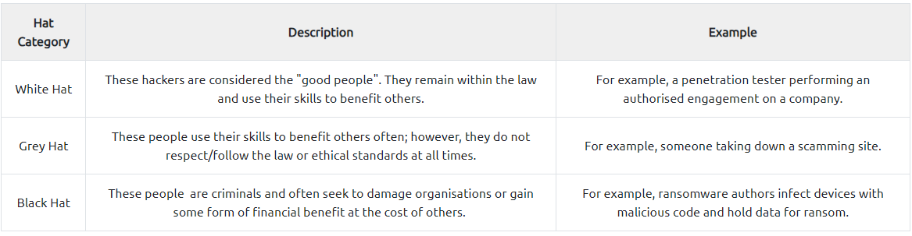

# Penetration Testing

Penetration testing, often referred to as ethical hacking, is a proactive cybersecurity approach where trained professionals simulate cyberattacks on a system, network, or application to identify and assess vulnerabilities.&#x20;

The primary goal of penetration testing is to uncover weaknesses in security defenses before malicious actors can exploit them.

Skilled ethical hackers use a combination of automated tools and manual techniques to simulate real-world cyber threats, attempting to exploit potential vulnerabilities and weaknesses in the target environment.&#x20;

The findings from penetration tests provide valuable insights to organizations, allowing them to strengthen their security posture, mitigate risks, and enhance overall resilience against cyber threats.

Hackers are sorted into three hats, where their ethics and motivations behind their actions determine what hat category they are placed into. Let's cover these three in the table below:

<figure><figcaption></figcaption></figure>
