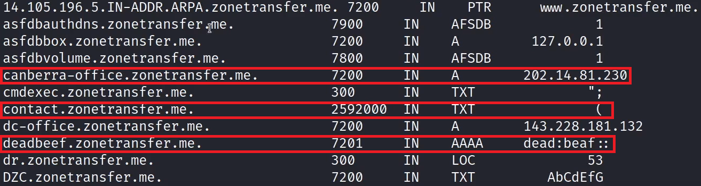
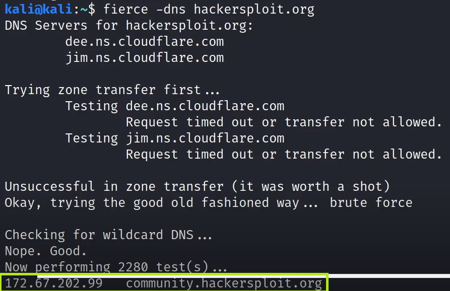

# DNS Zone Transfers

## What is DNS?

* Domain Name System (<mark style="color:red;">DNS</mark>) is a protocol that is used to resolve domain names/hostnames to IP addresses.
* A DNS server (nameserver) contains domain names and their corresponding IP addresses.
* Some DNS servers are:
  * Cloudflare (1.1.1.1)
  * Google (8.8.8.8)
  * These DNS servers contain the records of almost all domains of the internet.

### DNS Records

* <mark style="color:yellow;">A</mark>: IPv4 Addresses
* <mark style="color:yellow;">AAAA</mark>: IPv6 Addresses
* <mark style="color:yellow;">NS</mark>: Name Server
* <mark style="color:yellow;">MX</mark>: Mail server
* <mark style="color:yellow;">CNAME</mark>: Used for domain aliases
* <mark style="color:yellow;">TXT</mark>: TXT Records
* <mark style="color:yellow;">HINFO</mark>: Host information
* <mark style="color:yellow;">SOA (Start of Authority)</mark>: Domain authority
* <mark style="color:yellow;">SRV</mark>: Service records
* <mark style="color:yellow;">PTR</mark>: Resolves an IP address to a hostname

### DNS Interrogation

<mark style="color:red;">DNS interrogation</mark> is the process of enumerating DNS records for a specific domain.

The objective of DNS interrogation is to probe a DNS server to provide us with DNS records for a specific domain.

This process can provide with important information like the IP address of a domain, subdomains, mail server addresses etc..

### DNS Zone Transfers

In certains cases DNS server admins may want to copy or transfer zone files from one DNS server to another. This process is known as a <mark style="color:red;">zone transfer</mark>.

If misconfigured and left unsecured, it can be abused by attackers to copy the zone file from the primary DNS server to another DNS server (our own).

**Useful points:**

* DNS zone transfer can provide us with a holistic view of an organization's network layout.
* In certain cases, internal network addresses may be found on an organization's DNS servers.

### Practical Demo

<mark style="color:red;">dnsenum</mark> can be used to enumerate dns records that are publicly available, make a dns transfer automatically and also bruteforce dns.

<mark style="color:red;">dig</mark> is another DNS lookup utility used to execute DNS zone transfers.

<mark style="color:purple;">NOTE:</mark> Before asking the DNS servers for a resolution for an IP, our computer goes to the hosts file. In Linux it's stored in <mark style="color:green;">/etc/hosts</mark>.

### dnsenum demo

#### Command to run:

* <mark style="color:yellow;">dnsenum zonetransfer.me</mark>

<figure><figcaption></figcaption></figure>

* Host's addresses:&#x20;
  * <mark style="color:red;">zonetransfer.me</mark> is the hostname
  * <mark style="color:blue;">A</mark> records : Matches a domain name to an IPv4 address, in this case 5.196.105.14
* Name Servers:
  * Are the DNS name servers

<figure><figcaption></figcaption></figure>

* Mail (MX) Servers:
  * Are the domain mail servers

<figure><figcaption></figcaption></figure>

This last print shows some of the results obtained from the _zone transfer_ done by <mark style="color:red;">dnsenum</mark>

* <mark style="color:yellow;">canberra-office.zonetransfer.me</mark>
  * Also an <mark style="color:blue;">A</mark> record mapping to the IPv4 address of 202.14.81.230
* <mark style="color:yellow;">contact.zonetransfer.me</mark>
  * <mark style="color:blue;">TXT</mark> record: Stores text notes on a DNS server, in this case the content was "("
* <mark style="color:yellow;">deadbeef.zonetransfer.me</mark>
  * <mark style="color:blue;">AAAA</mark> record: Matches a domain name to an IPv6 address, in this case dead:beef ::&#x20;

### DNS zone transfer with dig

#### Command to run:

* <mark style="color:yellow;">dig axfr @nsztm1.digi.ninja zonetransfer.me</mark>
  * <mark style="color:blue;">axfr</mark>: Switch for zone transfer
  * <mark style="color:blue;">@</mark>: To specify the name server, in this case <mark style="color:green;">nsztm1.digi.ninja</mark>
  * <mark style="color:blue;">zonetransfer.me</mark>: Domain name

### Using "Fierce" for zone transfers and sub-domain bruteforcing

#### Command to run:

* <mark style="color:yellow;">fierce -dns zonetransfer.me</mark>

<figure><figcaption></figcaption></figure>

Since the zone transfer didn't work, because the domain <mark style="color:blue;">hackersploit.org</mark> is behind a firewall/Proxy (CloudFlare), <mark style="color:red;">fierce</mark> proceeds to bruteforcing.&#x20;

The surrounded IP is a sub-domain that the tool found.
